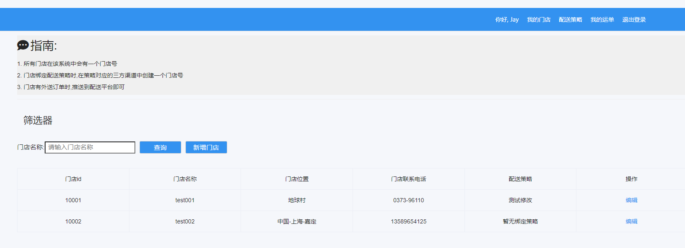

# easy-delivery Project

想学quarkus + 需要写论文 , 那么就用quarkus写一个简陋的项目吧



## 项目环境
环境:

- JDK 18 (大于11)
- Maven 3.8.6 (大于3.8.1)

## sql脚本
根目录下: `doc/init.sql`

## 项目启动

### 本地启动

```shell script
./mvnw compile quarkus:dev
```

### 服务器上启动
jar启动: 
```shell script
mvn clean package -U -Dquarkus.package.type=uber-jar
```
然后再target下java -jar 启动项目(没权限就加sudo)

## 后台功能
- localhost:9000/management/login 
- admin
- admin
<hr/>
维护三方渠道账号

## 前台功能
- localhost:9000/login
- 13666666666
- 123456

### 配送策略
维护一个策略,该策略是运单推送的依据

### 门店
配送需要一个发货方一个收货方,发货方一般是一个门店,因此直接叫门店  
门店需要配置一个配送策略,后续运单推送都将依照此策略进行推送

### 运单
理论上来说,运单应该是外送订单中异步操作的一环,应该直接调用接口  
但是作为演示,这里一个创建运单按钮,直接mock创建一个运单
